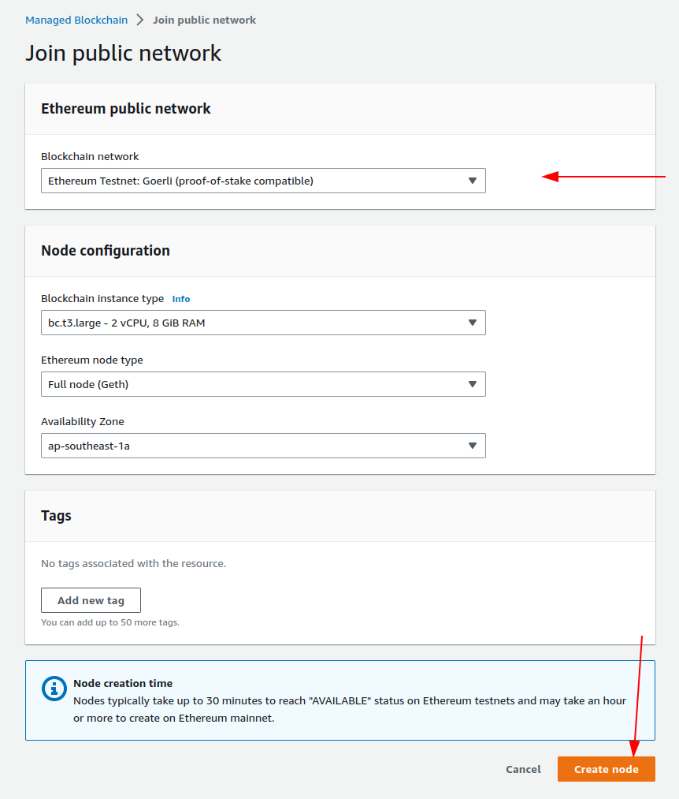
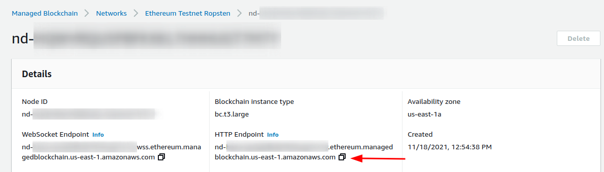

# Creating a node for Ethereum Testnet: Ropsten

**Before you begin** 

Clone this repository to your workspace or local machine.  You will use 
the code located in the specified directories at each step.   

## Creating your Amazon Blockchain Node
> Note: The creation of the node can take up to 30 minutes.
> 
To connect to the Ethereum network, we must create a node and connect it to the appropriate network. 
We will use *Ropsten*, also known as the *Ethereum Testnet*, which is a test network allowing for
blockchain development testing before deployment on Mainnet.  

This node will provide our endpoint to communicate with the Ethereum network.

To get started, create an Ethereum node in the AWS Console for [Amazon Managed Blockchain][1].

For *Blockchain Network*, select **Ethereum Testnet: Ropsten** and use the remaining
configuration default values that have already been populated then select **Create Node**
as outlined in the image below.

> As mentioned, at this point, the actual creation of the node can take up to 30 minutes.

When the node creation is complete, click the node ID to open the node details
page and copy the HTTP endpoint as pictured below, as it will be needed in our
next step, to connect our code to the appropriate endpoint for the contract to be created.

## Next Step

### [Deploy Contract](./DOCS_02_DEPLOY_CONTRACT.md)

[1]:https://console.aws.amazon.com/managedblockchain/home#joinNetwork
